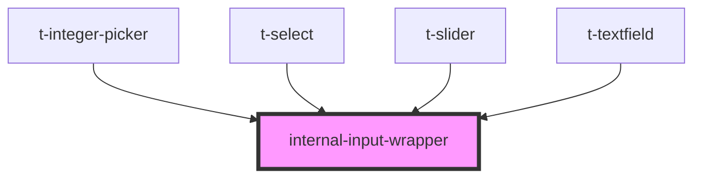

# internal-input-wrapper

<!-- Auto Generated Below -->

## Properties

| Property         | Attribute         | Description | Type              | Default |
| ---------------- | ----------------- | ----------- | ----------------- | ------- |
| `labelPlacement` | `label-placement` |             | `"left" \| "top"` | `'top'` |

## Dependencies

### Used by

 - [t-integer-picker](../t-integer-picker)
 - [t-select](../t-select)
 - [t-slider](../t-slider)
 - [t-textfield](../t-textfield)

### Graph

----------------------------------------------

*Built with [StencilJS](https://stenciljs.com/)*
