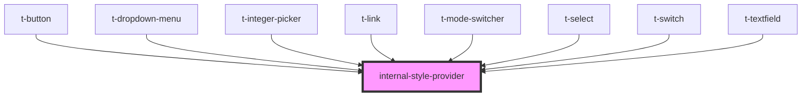

# internal-style-provider

<!-- Auto Generated Below -->

## Properties

| Property           | Attribute             | Description | Type     | Default |
| ------------------ | --------------------- | ----------- | -------- | ------- |
| `hueOffsetInTurns` | `hue-offset-in-turns` |             | `number` | `0`     |

## Dependencies

### Used by

 - [t-button](../t-button)
 - [t-dropdown-menu](../t-dropdown)
 - [t-integer-picker](../t-integer-picker)
 - [t-link](../t-link)
 - [t-mode-switcher](../t-mode-switcher)
 - [t-select](../t-select)
 - [t-switch](../t-switch)
 - [t-textfield](../t-textfield)

### Graph

----------------------------------------------

*Built with [StencilJS](https://stenciljs.com/)*
