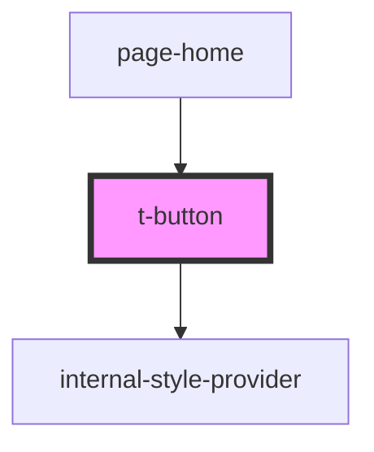

# t-button

<!-- Auto Generated Below -->

## Properties

| Property           | Attribute | Description | Type                                                                        | Default     |
| ------------------ | --------- | ----------- | --------------------------------------------------------------------------- | ----------- |
| `buttonAttributes` | --        |             | `ButtonHTMLAttributes<HTMLButtonElement> & DataAttributes & AriaAttributes` | `undefined` |
| `hue`              | `hue`     |             | `number`                                                                    | `0`         |

## Dependencies

### Used by

 - [page-home](../../preview-app/page-home)

### Depends on

- [internal-style-provider](../internal-style-provider)

### Graph

----------------------------------------------

*Built with [StencilJS](https://stenciljs.com/)*
