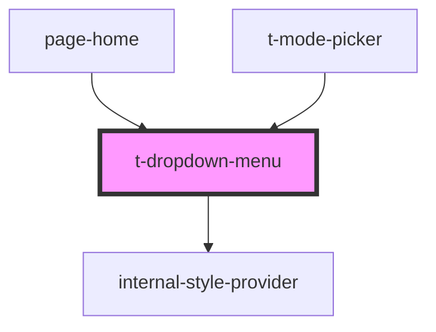

# t-dropdown-menu

<!-- Auto Generated Below -->

## Properties

| Property           | Attribute | Description | Type                                                                        | Default     |
| ------------------ | --------- | ----------- | --------------------------------------------------------------------------- | ----------- |
| `buttonAttributes` | --        |             | `ButtonHTMLAttributes<HTMLButtonElement> & DataAttributes & AriaAttributes` | `undefined` |
| `hue`              | `hue`     |             | `number`                                                                    | `0`         |
| `icon`             | --        |             | `VNode`                                                                     | `undefined` |
| `items`            | --        |             | `TDropdownMenuItem[]`                                                       | `[]`        |
| `label`            | `label`   |             | `VNode \| string`                                                           | `undefined` |
| `value`            | `value`   |             | `string`                                                                    | `undefined` |

## Dependencies

### Used by

 - [page-home](../../preview-app/page-home)
 - [t-mode-picker](../t-mode-switcher)

### Depends on

- [internal-style-provider](../internal-style-provider)

### Graph

----------------------------------------------

*Built with [StencilJS](https://stenciljs.com/)*
