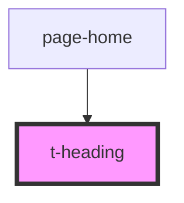

# t-heading

<!-- Auto Generated Below -->

## Properties

| Property | Attribute | Description | Type                         | Default |
| -------- | --------- | ----------- | ---------------------------- | ------- |
| `level`  | `level`   |             | `1 \| 2 \| 3 \| 4 \| 5 \| 6` | `1`     |

## Dependencies

### Used by

 - [page-home](../../pages/page-home)

### Graph

----------------------------------------------

*Built with [StencilJS](https://stenciljs.com/)*
