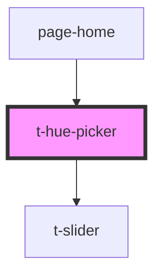

# t-hue-picker

<!-- Auto Generated Below -->

## Properties

| Property | Attribute | Description | Type     | Default     |
| -------- | --------- | ----------- | -------- | ----------- |
| `label`  | `label`   |             | `string` | `undefined` |
| `value`  | `value`   |             | `number` | `undefined` |

## Events

| Event       | Description | Type                  |
| ----------- | ----------- | --------------------- |
| `hueChange` |             | `CustomEvent<number>` |

## Dependencies

### Used by

 - [page-home](../../preview-app/page-home)

### Depends on

- [t-slider](../t-slider)

### Graph

----------------------------------------------

*Built with [StencilJS](https://stenciljs.com/)*
