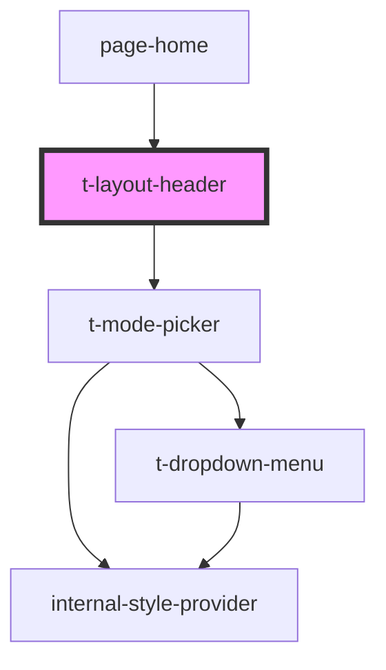

# t-layout-header

<!-- Auto Generated Below -->

## Properties

| Property    | Attribute    | Description | Type     | Default     |
| ----------- | ------------ | ----------- | -------- | ----------- |
| `siteTitle` | `site-title` |             | `string` | `undefined` |

## Dependencies

### Used by

 - [page-home](../../pages/page-home)

### Depends on

- [t-mode-picker](../t-mode-switcher)

### Graph

----------------------------------------------

*Built with [StencilJS](https://stenciljs.com/)*
