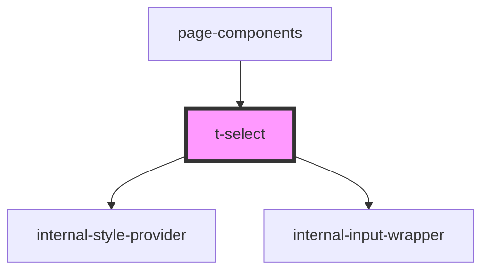

# t-select

<!-- Auto Generated Below -->

## Properties

| Property         | Attribute         | Description | Type              | Default     |
| ---------------- | ----------------- | ----------- | ----------------- | ----------- |
| `hue`            | `hue`             |             | `number`          | `0`         |
| `label`          | `label`           |             | `string`          | `undefined` |
| `labelPlacement` | `label-placement` |             | `"left" \| "top"` | `'top'`     |
| `options`        | --                |             | `TSelectOption[]` | `undefined` |
| `value`          | `value`           |             | `string`          | `undefined` |

## Dependencies

### Used by

 - [page-components](../../preview-app/page-components)

### Depends on

- [internal-style-provider](../internal-style-provider)
- [internal-input-wrapper](../internal-input-wrapper)

### Graph

----------------------------------------------

*Built with [StencilJS](https://stenciljs.com/)*
