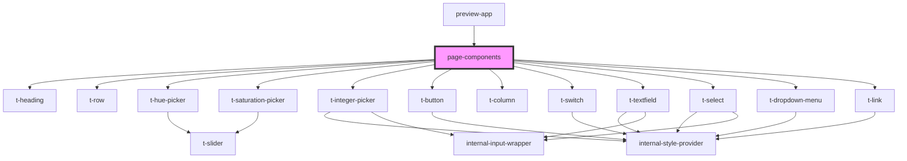

# page-components

<!-- Auto Generated Below -->

## Properties

| Property       | Attribute        | Description | Type     | Default |
| -------------- | ---------------- | ----------- | -------- | ------- |
| `baseChroma`   | `base-chroma`    |             | `number` | `0.4`   |
| `baseHue`      | `base-hue`       |             | `number` | `263`   |
| `numberOfHues` | `number-of-hues` |             | `number` | `3`     |

## Events

| Event                | Description | Type                  |
| -------------------- | ----------- | --------------------- |
| `chromaChange`       |             | `CustomEvent<number>` |
| `hueChange`          |             | `CustomEvent<number>` |
| `numberOfHuesChange` |             | `CustomEvent<number>` |

## Dependencies

### Used by

 - [preview-app](..)

### Depends on

- [t-heading](../../components/t-heading)
- [t-row](../../components/t-row)
- [t-hue-picker](../../components/t-hue-picker)
- [t-saturation-picker](../../components/t-saturation-picker)
- [t-integer-picker](../../components/t-integer-picker)
- [t-button](../../components/t-button)
- [t-column](../../components/t-column)
- [t-switch](../../components/t-switch)
- [t-textfield](../../components/t-textfield)
- [t-select](../../components/t-select)
- [t-dropdown-menu](../../components/t-dropdown)
- [t-link](../../components/t-link)

### Graph

----------------------------------------------

*Built with [StencilJS](https://stenciljs.com/)*
