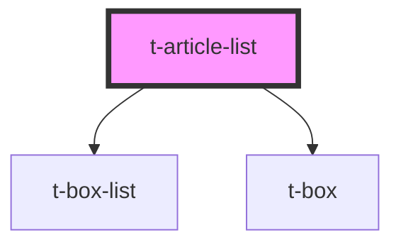

# t-article-list

<!-- Auto Generated Below -->

## Properties

| Property    | Attribute   | Description | Type                 | Default |
| ----------- | ----------- | ----------- | -------------------- | ------- |
| `hueoffset` | `hueoffset` |             | `number`             | `0`     |
| `items`     | --          |             | `TArticleListItem[]` | `[]`    |

## Dependencies

### Depends on

- [t-box-list](../t-box-list)
- [t-box](../t-box)

### Graph

----------------------------------------------

*Built with [StencilJS](https://stenciljs.com/)*
