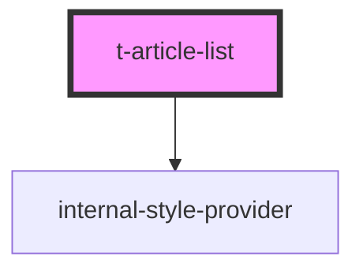

# t-article-list

<!-- Auto Generated Below -->

## Properties

| Property | Attribute | Description | Type                 | Default |
| -------- | --------- | ----------- | -------------------- | ------- |
| `hue`    | `hue`     |             | `number`             | `0`     |
| `items`  | --        |             | `TArticleListItem[]` | `[]`    |

## Dependencies

### Depends on

- [internal-style-provider](../internal-style-provider)

### Graph

----------------------------------------------

*Built with [StencilJS](https://stenciljs.com/)*
