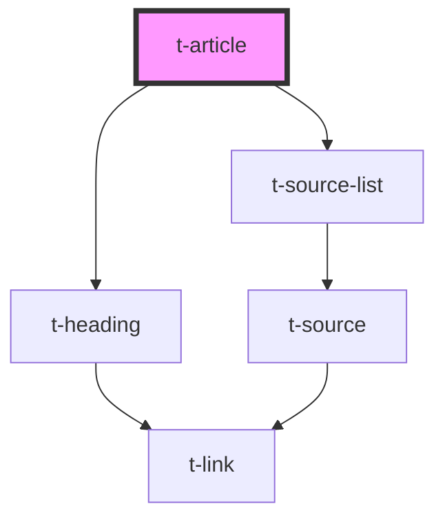

# t-article

<!-- Auto Generated Below -->

## Properties

| Property  | Attribute | Description | Type                             | Default       |
| --------- | --------- | ----------- | -------------------------------- | ------------- |
| `heading` | `heading` |             | `string`                         | `undefined`   |
| `sources` | --        |             | `{ [id: string]: TSourceItem; }` | `{}`          |
| `text`    | --        |             | `{ sourcesHeading: string; }`    | `defaultText` |

## Methods

### `getSourceOrder() => Promise<string[]>`

#### Returns

Type: `Promise<string[]>`

## Dependencies

### Depends on

- [t-heading](../t-heading)
- [t-source-list](../t-source-list)

### Graph

----------------------------------------------

*Built with [StencilJS](https://stenciljs.com/)*
