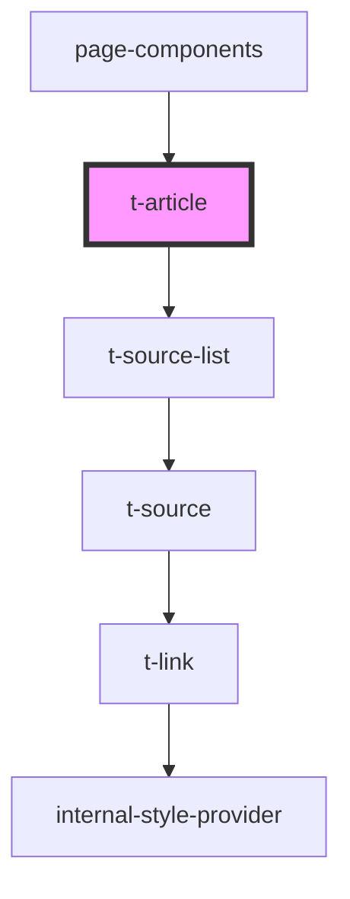

# t-article

<!-- Auto Generated Below -->

## Properties

| Property  | Attribute | Description | Type                             | Default |
| --------- | --------- | ----------- | -------------------------------- | ------- |
| `sources` | --        |             | `{ [id: string]: TSourceItem; }` | `{}`    |

## Dependencies

### Used by

 - [page-components](../../preview-app/page-components)

### Depends on

- [t-source-list](../t-source-list)

### Graph

----------------------------------------------

*Built with [StencilJS](https://stenciljs.com/)*
