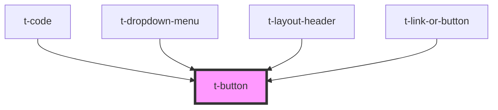

# t-button

<!-- Auto Generated Below -->

## Properties

| Property           | Attribute   | Description | Type                                                                        | Default     |
| ------------------ | ----------- | ----------- | --------------------------------------------------------------------------- | ----------- |
| `buttonAttributes` | --          |             | `ButtonHTMLAttributes<HTMLButtonElement> & DataAttributes & AriaAttributes` | `undefined` |
| `focusable`        | `focusable` |             | `boolean`                                                                   | `true`      |
| `hueoffset`        | `hueoffset` |             | `number`                                                                    | `0`         |
| `variant`          | `variant`   |             | `"default" \| "link" \| "transparent"`                                      | `'default'` |

## Events

| Event         | Description | Type                      |
| ------------- | ----------- | ------------------------- |
| `buttonClick` |             | `CustomEvent<MouseEvent>` |

## Methods

### `focusOnButton() => Promise<void>`

#### Returns

Type: `Promise<void>`

## Dependencies

### Used by

 - [t-code](../t-code)
 - [t-dropdown-menu](../t-dropdown)
 - [t-layout-header](../t-layout-header)
 - [t-link-or-button](../t-link-or-button)

### Graph

----------------------------------------------

*Built with [StencilJS](https://stenciljs.com/)*
