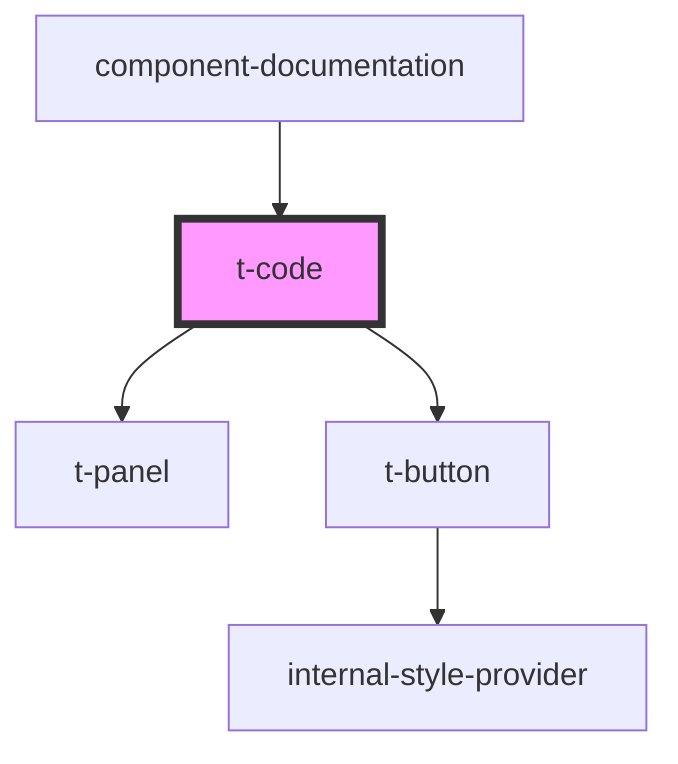

# t-code

<!-- Auto Generated Below -->

## Properties

| Property          | Attribute           | Description | Type                             | Default         |
| ----------------- | ------------------- | ----------- | -------------------------------- | --------------- |
| `code`            | `code`              |             | `string`                         | `undefined`     |
| `copyButtonTitle` | `copy-button-title` |             | `string`                         | `'Kopier kode'` |
| `language`        | `language`          |             | `string`                         | `undefined`     |
| `mode`            | `mode`              |             | `"block" \| "inline" \| "panel"` | `'inline'`      |
| `trimmargin`      | `trimmargin`        |             | `boolean`                        | `false`         |

## Dependencies

### Used by

 - [component-documentation](../../preview-app/component-documentation)

### Depends on

- [t-panel](../t-panel)
- [t-button](../t-button)

### Graph

----------------------------------------------

*Built with [StencilJS](https://stenciljs.com/)*
