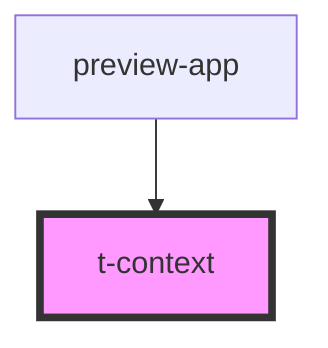

# t-context

<!-- Auto Generated Below -->

## Properties

| Property               | Attribute              | Description | Type     | Default                           |
| ---------------------- | ---------------------- | ----------- | -------- | --------------------------------- |
| `basechroma`           | `basechroma`           |             | `number` | `DEFAULT_CHROMA`                  |
| `basehue`              | `basehue`              |             | `number` | `DEFAULT_HUE`                     |
| `contrast`             | `contrast`             |             | `number` | `1`                               |
| `hueoffsetcode`        | `hueoffsetcode`        |             | `number` | `DEFAULT_HUE_OFFSET_CODE`         |
| `hueoffsetvisitedlink` | `hueoffsetvisitedlink` |             | `number` | `DEFAULT_HUE_OFFSET_VISITED_LINK` |

## Methods

### `selectMode(mode: SelectedMode) => Promise<void>`

#### Parameters

| Name   | Type               | Description |
| ------ | ------------------ | ----------- |
| `mode` | `"system" \| Mode` |             |

#### Returns

Type: `Promise<void>`

## Dependencies

### Used by

 - [preview-app](../../preview-app)

### Graph

----------------------------------------------

*Built with [StencilJS](https://stenciljs.com/)*
