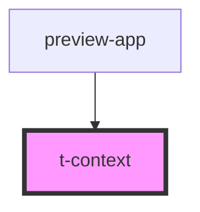

# t-context

<!-- Auto Generated Below -->

## Properties

| Property     | Attribute     | Description | Type     | Default |
| ------------ | ------------- | ----------- | -------- | ------- |
| `baseChroma` | `base-chroma` |             | `number` | `0.4`   |
| `baseHue`    | `base-hue`    |             | `number` | `263`   |
| `contrast`   | `contrast`    |             | `number` | `1`     |

## Dependencies

### Used by

 - [preview-app](../../preview-app)

### Graph

----------------------------------------------

*Built with [StencilJS](https://stenciljs.com/)*
