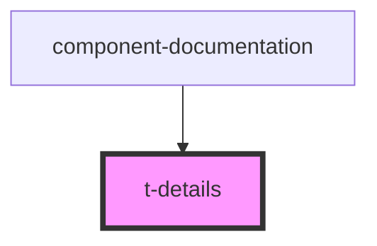

# t-details

<!-- Auto Generated Below -->

## Properties

| Property      | Attribute      | Description | Type     | Default     |
| ------------- | -------------- | ----------- | -------- | ----------- |
| `openSummary` | `open-summary` |             | `string` | `undefined` |
| `summary`     | `summary`      |             | `string` | `undefined` |

## Dependencies

### Used by

 - [component-documentation](../../preview-app/component-documentation)

### Graph

----------------------------------------------

*Built with [StencilJS](https://stenciljs.com/)*
