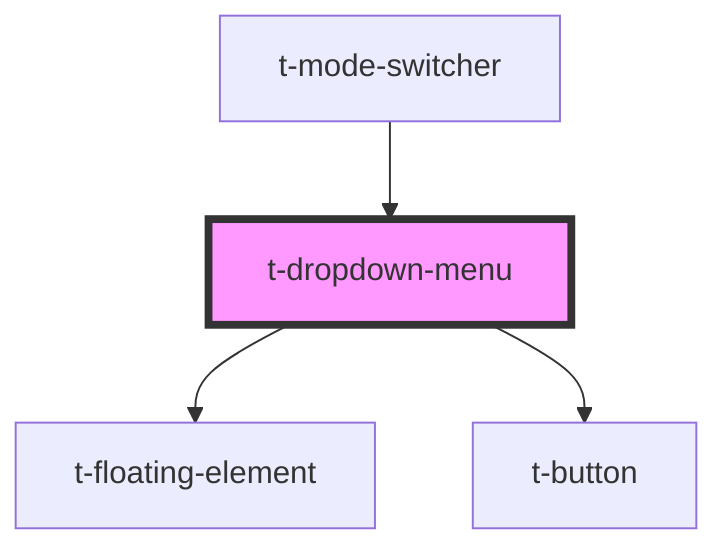

# t-dropdown-menu

<!-- Auto Generated Below -->

## Properties

| Property           | Attribute   | Description | Type                                                                        | Default     |
| ------------------ | ----------- | ----------- | --------------------------------------------------------------------------- | ----------- |
| `buttonAttributes` | --          |             | `ButtonHTMLAttributes<HTMLButtonElement> & DataAttributes & AriaAttributes` | `undefined` |
| `hueoffset`        | `hueoffset` |             | `number`                                                                    | `0`         |
| `items`            | --          |             | `TDropdownMenuItem[]`                                                       | `[]`        |
| `label`            | `label`     |             | `VNode \| string`                                                           | `undefined` |
| `value`            | `value`     |             | `string`                                                                    | `undefined` |
| `variant`          | `variant`   |             | `"default" \| "link" \| "transparent" \| "without-background"`              | `'default'` |

## Dependencies

### Used by

 - [t-mode-switcher](../t-mode-switcher)

### Depends on

- [t-floating-element](../t-floating-element)
- [t-button](../t-button)

### Graph

----------------------------------------------

*Built with [StencilJS](https://stenciljs.com/)*
