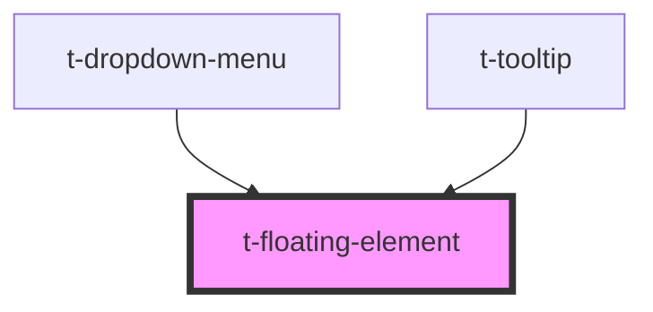

# t-floating-element

<!-- Auto Generated Below -->

## Properties

| Property    | Attribute   | Description | Type                                                                                                                                                                           | Default  |
| ----------- | ----------- | ----------- | ------------------------------------------------------------------------------------------------------------------------------------------------------------------------------ | -------- |
| `placement` | `placement` |             | `"auto" \| "bottom" \| "bottom-end" \| "bottom-start" \| "left" \| "left-end" \| "left-start" \| "right" \| "right-end" \| "right-start" \| "top" \| "top-end" \| "top-start"` | `'auto'` |
| `visible`   | `visible`   |             | `boolean`                                                                                                                                                                      | `false`  |

## Events

| Event          | Description | Type                      |
| -------------- | ----------- | ------------------------- |
| `clickOutside` |             | `CustomEvent<MouseEvent>` |

## Dependencies

### Used by

 - [t-dropdown-menu](../t-dropdown)
 - [t-tooltip](../t-tooltip)

### Graph

----------------------------------------------

*Built with [StencilJS](https://stenciljs.com/)*
