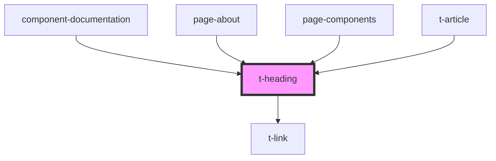

# t-heading

<!-- Auto Generated Below -->

## Properties

| Property | Attribute | Description | Type                         | Default |
| -------- | --------- | ----------- | ---------------------------- | ------- |
| `level`  | `level`   |             | `1 \| 2 \| 3 \| 4 \| 5 \| 6` | `1`     |

## Dependencies

### Used by

 - [component-documentation](../../preview-app/component-documentation)
 - [page-about](../../preview-app/page-about)
 - [page-components](../../preview-app/page-components)
 - [t-article](../t-article)

### Depends on

- [t-link](../t-link)

### Graph

----------------------------------------------

*Built with [StencilJS](https://stenciljs.com/)*
