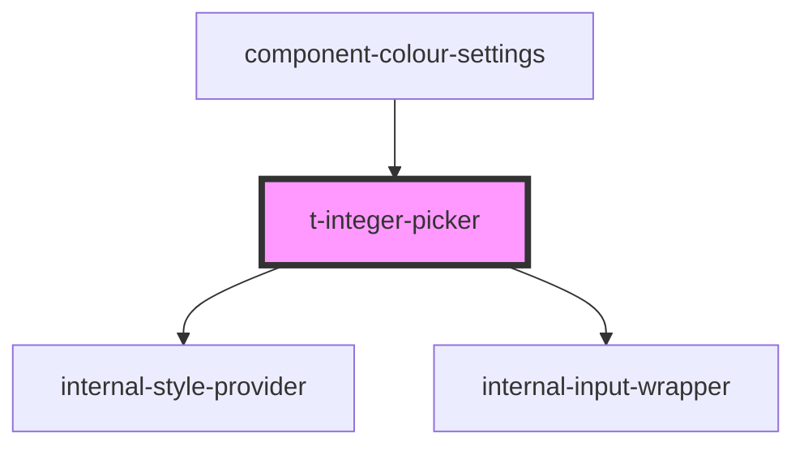

# t-integer-picker

<!-- Auto Generated Below -->

## Properties

| Property | Attribute | Description | Type     | Default     |
| -------- | --------- | ----------- | -------- | ----------- |
| `hue`    | `hue`     |             | `number` | `undefined` |
| `label`  | `label`   |             | `string` | `undefined` |
| `max`    | `max`     |             | `number` | `undefined` |
| `min`    | `min`     |             | `number` | `undefined` |
| `value`  | `value`   |             | `number` | `undefined` |

## Events

| Event           | Description | Type                  |
| --------------- | ----------- | --------------------- |
| `integerChange` |             | `CustomEvent<number>` |

## Dependencies

### Used by

 - [component-colour-settings](../../preview-app/component-colour-settings)

### Depends on

- [internal-style-provider](../internal-style-provider)
- [internal-input-wrapper](../internal-input-wrapper)

### Graph

----------------------------------------------

*Built with [StencilJS](https://stenciljs.com/)*
