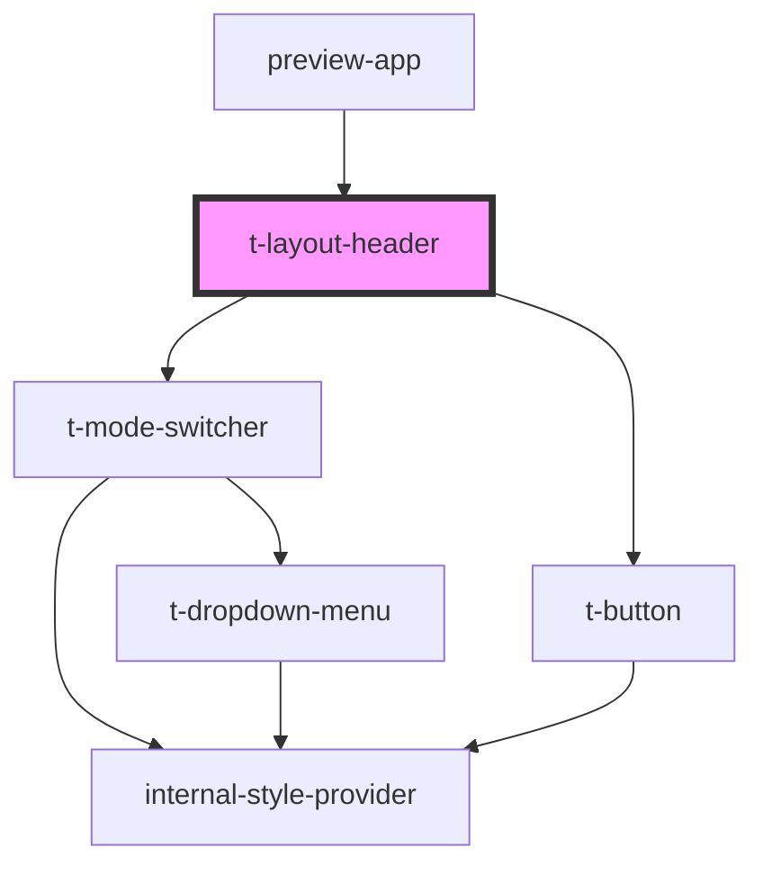

# t-layout-header

<!-- Auto Generated Below -->

## Properties

| Property    | Attribute    | Description | Type             | Default     |
| ----------- | ------------ | ----------- | ---------------- | ----------- |
| `navItems`  | --           |             | `TNavMenuItem[]` | `[]`        |
| `siteTitle` | `site-title` |             | `string`         | `undefined` |

## Dependencies

### Used by

 - [preview-app](../../preview-app)

### Depends on

- [t-mode-switcher](../t-mode-switcher)
- [t-button](../t-button)

### Graph

----------------------------------------------

*Built with [StencilJS](https://stenciljs.com/)*
