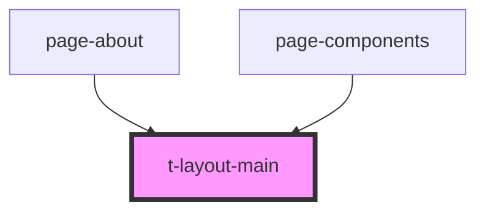

# t-layout-main

<!-- Auto Generated Below -->

## Properties

| Property        | Attribute        | Description | Type                                                  | Default       |
| --------------- | ---------------- | ----------- | ----------------------------------------------------- | ------------- |
| `stickyLeftbar` | `sticky-leftbar` |             | `boolean`                                             | `false`       |
| `text`          | --               |             | `{ expandSidebar: string; collapseSidebar: string; }` | `defaultText` |

## Dependencies

### Used by

 - [page-about](../../preview-app/page-about)
 - [page-components](../../preview-app/page-components)

### Graph

----------------------------------------------

*Built with [StencilJS](https://stenciljs.com/)*
