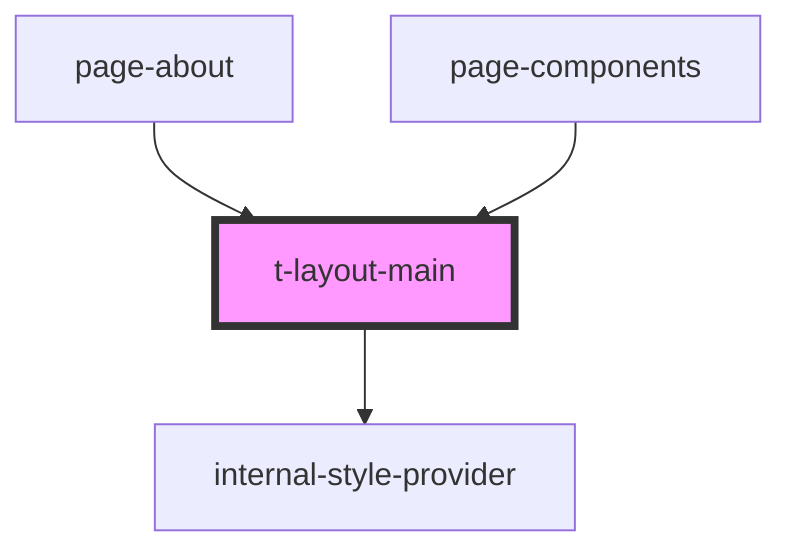

# t-layout-main

<!-- Auto Generated Below -->

## Properties

| Property        | Attribute        | Description | Type      | Default |
| --------------- | ---------------- | ----------- | --------- | ------- |
| `stickyLeftbar` | `sticky-leftbar` |             | `boolean` | `false` |

## Dependencies

### Used by

 - [page-about](../../preview-app/page-about)
 - [page-components](../../preview-app/page-components)

### Depends on

- [internal-style-provider](../internal-style-provider)

### Graph

----------------------------------------------

*Built with [StencilJS](https://stenciljs.com/)*
