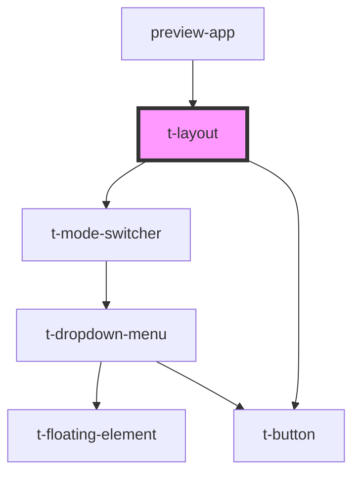

# t-layout

<!-- Auto Generated Below -->

## Properties

| Property            | Attribute           | Description | Type                                                  | Default       |
| ------------------- | ------------------- | ----------- | ----------------------------------------------------- | ------------- |
| `leftbarvisibility` | `leftbarvisibility` |             | `"hidden" \| "largescreenonly" \| "visible"`          | `'visible'`   |
| `sitetitle`         | `sitetitle`         |             | `string`                                              | `undefined`   |
| `stickyleftbar`     | `stickyleftbar`     |             | `boolean`                                             | `false`       |
| `text`              | --                  |             | `{ expandSidebar: string; collapseSidebar: string; }` | `defaultText` |

## Dependencies

### Used by

 - [preview-app](../../preview-app)

### Depends on

- [t-mode-switcher](../t-mode-switcher)
- [t-button](../t-button)

### Graph

----------------------------------------------

*Built with [StencilJS](https://stenciljs.com/)*
