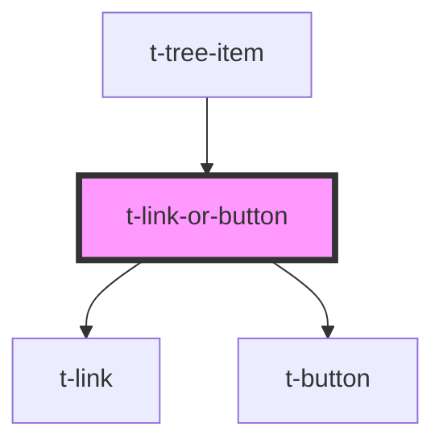

# t-link-or-button

<!-- Auto Generated Below -->

## Properties

| Property    | Attribute   | Description | Type      | Default |
| ----------- | ----------- | ----------- | --------- | ------- |
| `focusable` | `focusable` |             | `boolean` | `true`  |
| `href`      | `href`      |             | `string`  | `null`  |
| `target`    | `target`    |             | `string`  | `null`  |

## Events

| Event          | Description | Type                      |
| -------------- | ----------- | ------------------------- |
| `elementClick` |             | `CustomEvent<MouseEvent>` |

## Methods

### `focusOnElement() => Promise<void>`

#### Returns

Type: `Promise<void>`

## Dependencies

### Used by

 - [t-tree-item](../t-tree-item)

### Depends on

- [t-link](../t-link)
- [t-button](../t-button)

### Graph

----------------------------------------------

*Built with [StencilJS](https://stenciljs.com/)*
