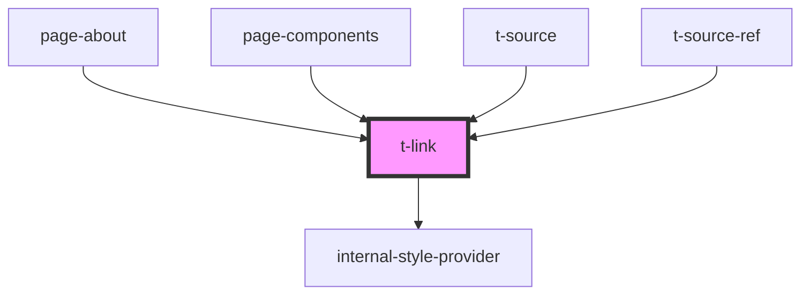

# t-link

<!-- Auto Generated Below -->

## Properties

| Property   | Attribute  | Description | Type      | Default     |
| ---------- | ---------- | ----------- | --------- | ----------- |
| `external` | `external` |             | `boolean` | `undefined` |
| `href`     | `href`     |             | `string`  | `undefined` |
| `target`   | `target`   |             | `string`  | `undefined` |

## Dependencies

### Used by

 - [page-about](../../preview-app/page-about)
 - [page-components](../../preview-app/page-components)
 - [t-source](../t-source)
 - [t-source-ref](../t-source-ref)

### Depends on

- [internal-style-provider](../internal-style-provider)

### Graph

----------------------------------------------

*Built with [StencilJS](https://stenciljs.com/)*
