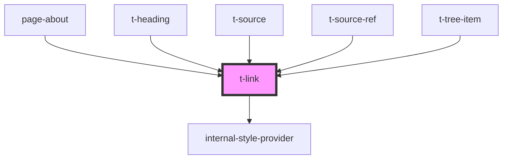

# t-link

<!-- Auto Generated Below -->

## Properties

| Property    | Attribute   | Description | Type      | Default     |
| ----------- | ----------- | ----------- | --------- | ----------- |
| `external`  | `external`  |             | `boolean` | `undefined` |
| `focusable` | `focusable` |             | `boolean` | `true`      |
| `href`      | `href`      |             | `string`  | `undefined` |
| `target`    | `target`    |             | `string`  | `undefined` |

## Methods

### `getAnchorElement() => Promise<HTMLAnchorElement>`

#### Returns

Type: `Promise<HTMLAnchorElement>`

## Shadow Parts

| Part     | Description |
| -------- | ----------- |
| `"link"` |             |

## Dependencies

### Used by

 - [page-about](../../preview-app/page-about)
 - [t-heading](../t-heading)
 - [t-source](../t-source)
 - [t-source-ref](../t-source-ref)
 - [t-tree-item](../t-tree-item)

### Depends on

- [internal-style-provider](../internal-style-provider)

### Graph

----------------------------------------------

*Built with [StencilJS](https://stenciljs.com/)*
