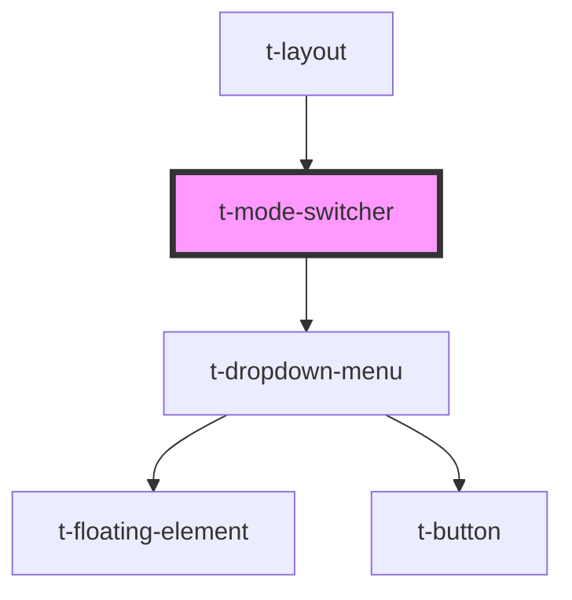

# t-mode-picker

<!-- Auto Generated Below -->

## Properties

| Property         | Attribute         | Description | Type      | Default     |
| ---------------- | ----------------- | ----------- | --------- | ----------- |
| `hueoffset`      | `hueoffset`       |             | `number`  | `0`         |
| `label`          | `label`           |             | `string`  | `undefined` |
| `systemSelected` | `system-selected` |             | `boolean` | `true`      |

## Dependencies

### Used by

 - [t-layout](../t-layout)

### Depends on

- [t-dropdown-menu](../t-dropdown)

### Graph

----------------------------------------------

*Built with [StencilJS](https://stenciljs.com/)*
