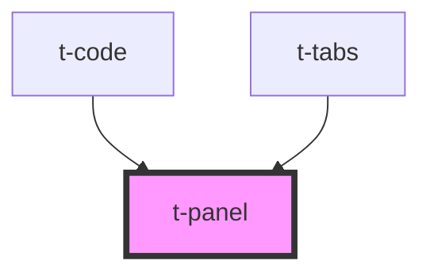

# t-panel

<!-- Auto Generated Below -->

## Properties

| Property    | Attribute   | Description | Type     | Default |
| ----------- | ----------- | ----------- | -------- | ------- |
| `hueoffset` | `hueoffset` |             | `number` | `0`     |

## Dependencies

### Used by

 - [t-code](../t-code)
 - [t-tabs](../t-tabs)

### Graph

----------------------------------------------

*Built with [StencilJS](https://stenciljs.com/)*
