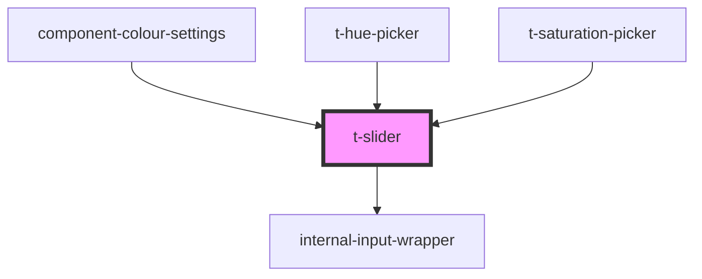

# t-slider

<!-- Auto Generated Below -->

## Properties

| Property | Attribute | Description | Type     | Default     |
| -------- | --------- | ----------- | -------- | ----------- |
| `label`  | `label`   |             | `string` | `undefined` |
| `max`    | `max`     |             | `number` | `1`         |
| `min`    | `min`     |             | `number` | `0`         |
| `step`   | `step`    |             | `number` | `0.01`      |
| `value`  | `value`   |             | `number` | `undefined` |

## Events

| Event          | Description | Type                  |
| -------------- | ----------- | --------------------- |
| `sliderChange` |             | `CustomEvent<number>` |

## Dependencies

### Used by

 - [component-colour-settings](../../preview-app/component-colour-settings)
 - [t-hue-picker](../t-hue-picker)
 - [t-saturation-picker](../t-saturation-picker)

### Depends on

- [internal-input-wrapper](../internal-input-wrapper)

### Graph

----------------------------------------------

*Built with [StencilJS](https://stenciljs.com/)*
