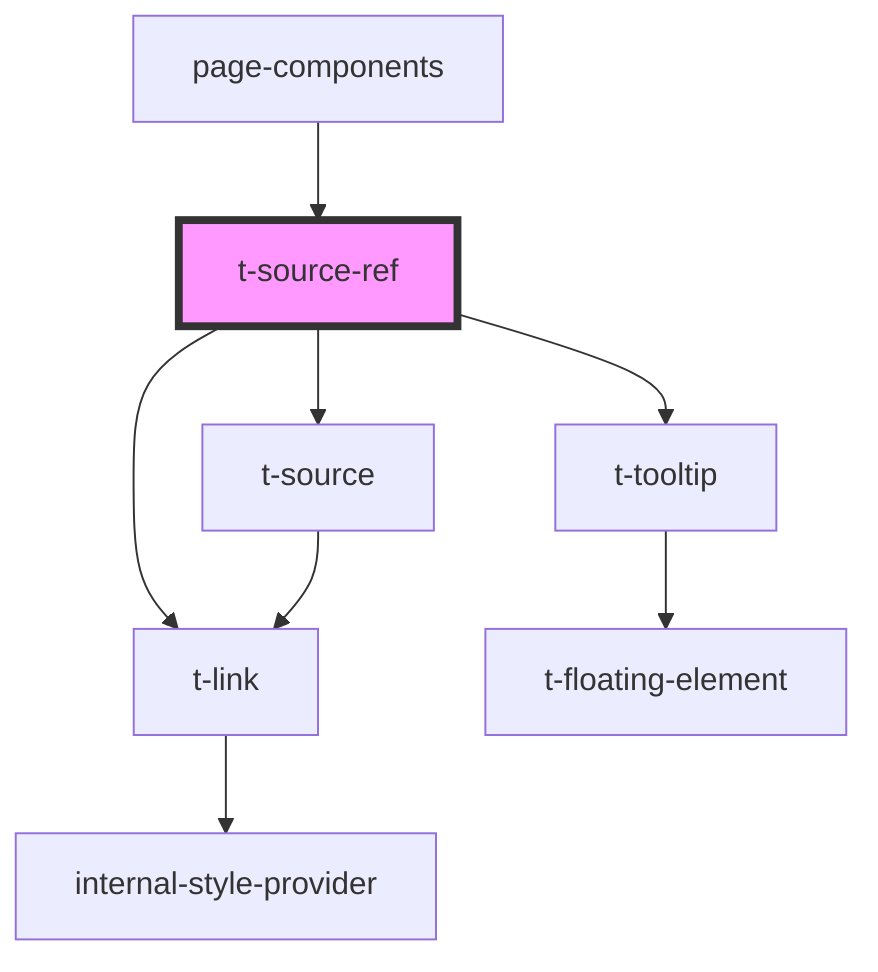

# t-source-ref

<!-- Auto Generated Below -->

## Properties

| Property   | Attribute   | Description | Type     | Default     |
| ---------- | ----------- | ----------- | -------- | ----------- |
| `sourceId` | `source-id` |             | `string` | `undefined` |

## Dependencies

### Used by

 - [page-components](../../preview-app/page-components)

### Depends on

- [t-tooltip](../t-tooltip)
- [t-link](../t-link)
- [t-source](../t-source)

### Graph

----------------------------------------------

*Built with [StencilJS](https://stenciljs.com/)*
