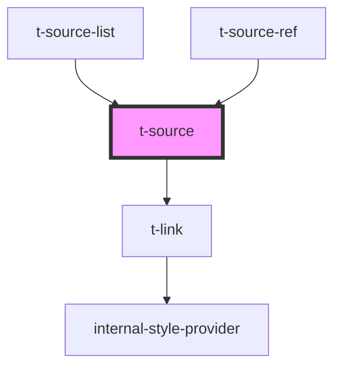

# t-source

<!-- Auto Generated Below -->

## Properties

| Property    | Attribute | Description | Type                                                                                                                                                                                                                                                                                                      | Default                  |
| ----------- | --------- | ----------- | --------------------------------------------------------------------------------------------------------------------------------------------------------------------------------------------------------------------------------------------------------------------------------------------------------- | ------------------------ |
| `pagesText` | --        |             | `(pages: string) => string`                                                                                                                                                                                                                                                                               | `pages => `s. ${pages}`` |
| `source`    | --        |             | `{ articleTitle?: string; authors: Author[]; bookTitle?: string; city?: string; date?: SourceDate; doi?: string; isbn?: string; issue?: number; journal?: string; pageEnd?: number; pageStart?: number; publisher?: string; retrievedDate?: SourceDate; title?: string; url?: string; volume?: number; }` | `undefined`              |

## Dependencies

### Used by

 - [t-source-list](../t-source-list)
 - [t-source-ref](../t-source-ref)

### Depends on

- [t-link](../t-link)

### Graph

----------------------------------------------

*Built with [StencilJS](https://stenciljs.com/)*
