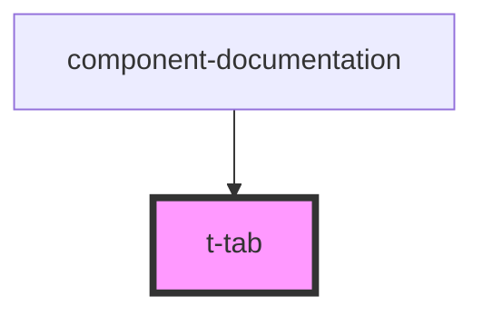

# t-tab

<!-- Auto Generated Below -->

## Properties

| Property  | Attribute | Description | Type     | Default     |
| --------- | --------- | ----------- | -------- | ----------- |
| `heading` | `heading` |             | `string` | `undefined` |
| `name`    | `name`    |             | `string` | `undefined` |

## Dependencies

### Used by

 - [component-documentation](../../preview-app/component-documentation)

### Graph

----------------------------------------------

*Built with [StencilJS](https://stenciljs.com/)*
