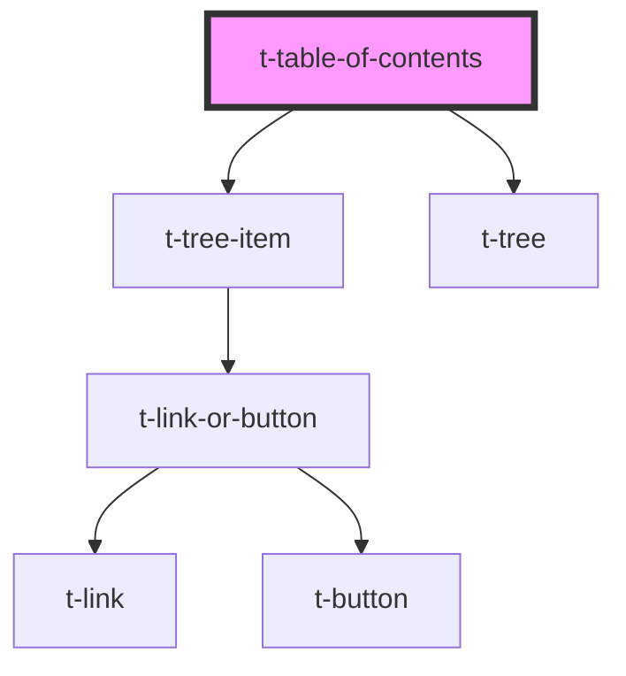

# t-table-of-contents

<!-- Auto Generated Below -->

## Properties

| Property | Attribute | Description | Type     | Default     |
| -------- | --------- | ----------- | -------- | ----------- |
| `label`  | `label`   |             | `string` | `undefined` |

## Dependencies

### Depends on

- [t-tree-item](../t-tree-item)
- [t-tree](../t-tree)

### Graph

----------------------------------------------

*Built with [StencilJS](https://stenciljs.com/)*
