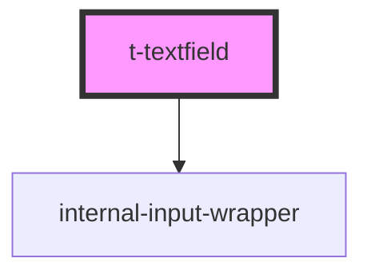

# t-textfield

<!-- Auto Generated Below -->

## Properties

| Property | Attribute | Description | Type     | Default     |
| -------- | --------- | ----------- | -------- | ----------- |
| `hue`    | `hue`     |             | `number` | `0`         |
| `label`  | `label`   |             | `string` | `undefined` |
| `value`  | `value`   |             | `string` | `undefined` |

## Events

| Event         | Description | Type                  |
| ------------- | ----------- | --------------------- |
| `valueChange` |             | `CustomEvent<string>` |

## Dependencies

### Depends on

- [internal-input-wrapper](../internal-input-wrapper)

### Graph

----------------------------------------------

*Built with [StencilJS](https://stenciljs.com/)*
