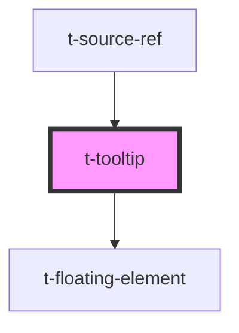

# t-tooltip

<!-- Auto Generated Below -->

## Dependencies

### Used by

 - [t-source-ref](../t-source-ref)

### Depends on

- [t-floating-element](../t-floating-element)

### Graph

----------------------------------------------

*Built with [StencilJS](https://stenciljs.com/)*
