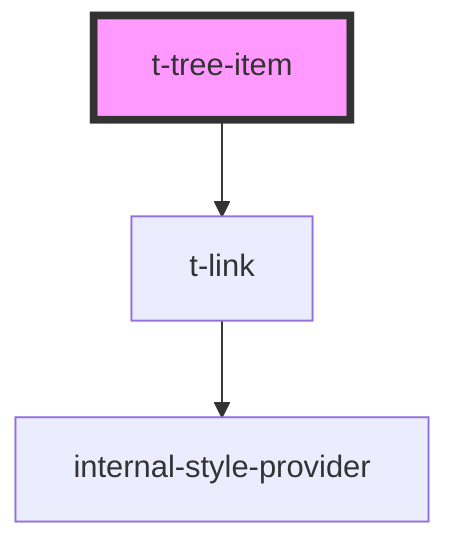

# t-tree-item

<!-- Auto Generated Below -->

## Properties

| Property | Attribute | Description | Type     | Default     |
| -------- | --------- | ----------- | -------- | ----------- |
| `href`   | `href`    |             | `string` | `null`      |
| `label`  | `label`   |             | `string` | `undefined` |

## Methods

### `focusOnLink() => Promise<void>`

#### Returns

Type: `Promise<void>`

### `getLastVisibleSubItem() => Promise<HTMLTTreeItemElement | null>`

#### Returns

Type: `Promise<HTMLTTreeItemElement>`

### `getNextVisibleItem() => Promise<HTMLTTreeItemElement | null>`

#### Returns

Type: `Promise<HTMLTTreeItemElement>`

### `getPreviousVisibleItem() => Promise<HTMLTTreeItemElement | null>`

#### Returns

Type: `Promise<HTMLTTreeItemElement>`

### `getRoot() => Promise<HTMLTTreeElement>`

#### Returns

Type: `Promise<HTMLTTreeElement>`

### `getSubItems() => Promise<NodeListOf<HTMLTTreeItemElement>>`

#### Returns

Type: `Promise<NodeListOf<HTMLTTreeItemElement>>`

### `getVisibleSubItems() => Promise<HTMLTTreeItemElement[]>`

#### Returns

Type: `Promise<HTMLTTreeItemElement[]>`

### `isExpanded() => Promise<boolean>`

#### Returns

Type: `Promise<boolean>`

### `isFocusable() => Promise<boolean>`

#### Returns

Type: `Promise<boolean>`

### `isTopLevel() => Promise<boolean>`

#### Returns

Type: `Promise<boolean>`

### `isVisible() => Promise<boolean>`

#### Returns

Type: `Promise<boolean>`

### `setFocusable(focusable: boolean) => Promise<boolean>`

#### Parameters

| Name        | Type      | Description |
| ----------- | --------- | ----------- |
| `focusable` | `boolean` |             |

#### Returns

Type: `Promise<boolean>`

## Dependencies

### Depends on

- [t-link](../t-link)

### Graph

----------------------------------------------

*Built with [StencilJS](https://stenciljs.com/)*
