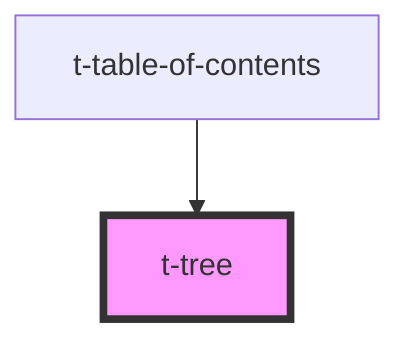

# t-tree

<!-- Auto Generated Below -->

## Properties

| Property | Attribute | Description | Type     | Default     |
| -------- | --------- | ----------- | -------- | ----------- |
| `label`  | `label`   |             | `string` | `undefined` |

## Methods

### `getAllItems() => Promise<NodeListOf<HTMLTTreeItemElement>>`

#### Returns

Type: `Promise<NodeListOf<HTMLTTreeItemElement>>`

### `getAllVisibleItems() => Promise<HTMLTTreeItemElement[]>`

#### Returns

Type: `Promise<HTMLTTreeItemElement[]>`

### `makeFirstItemFocusable() => Promise<void>`

#### Returns

Type: `Promise<void>`

### `resetTabindex() => Promise<void>`

#### Returns

Type: `Promise<void>`

## Dependencies

### Used by

 - [t-table-of-contents](../t-table-of-contents)

### Graph

----------------------------------------------

*Built with [StencilJS](https://stenciljs.com/)*
