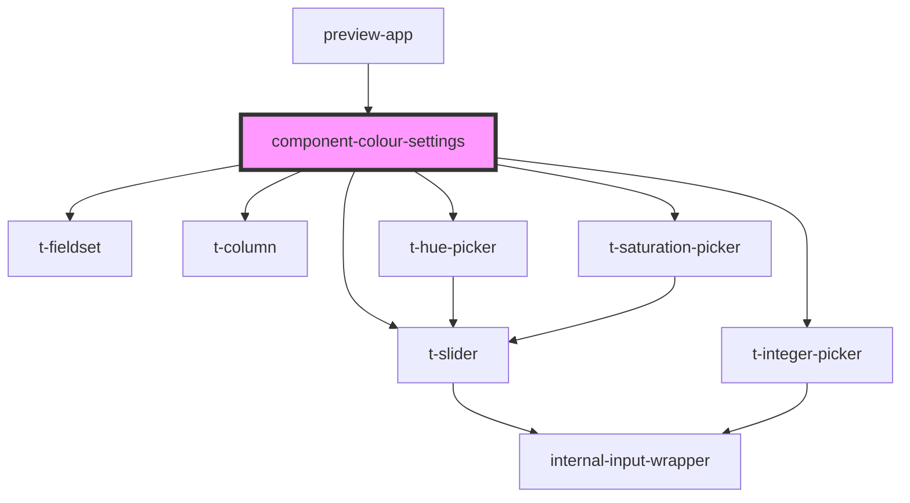

# component-colour-settings

<!-- Auto Generated Below -->

## Properties

| Property   | Attribute | Description | Type                                                                                                                            | Default     |
| ---------- | --------- | ----------- | ------------------------------------------------------------------------------------------------------------------------------- | ----------- |
| `settings` | --        |             | `{ hue: number; chroma: number; numberOfHues: number; contrast: number; hueOffsetVisitedLink: number; hueOffsetCode: number; }` | `undefined` |

## Events

| Event            | Description | Type                                                                                                                                         |
| ---------------- | ----------- | -------------------------------------------------------------------------------------------------------------------------------------------- |
| `changeSettings` |             | `CustomEvent<{ hue: number; chroma: number; numberOfHues: number; contrast: number; hueOffsetVisitedLink: number; hueOffsetCode: number; }>` |

## Dependencies

### Used by

 - [preview-app](..)

### Depends on

- [t-fieldset](../../components/t-fieldset)
- [t-column](../../components/t-column)
- [t-hue-picker](../../components/t-hue-picker)
- [t-saturation-picker](../../components/t-saturation-picker)
- [t-integer-picker](../../components/t-integer-picker)
- [t-slider](../../components/t-slider)

### Graph

----------------------------------------------

*Built with [StencilJS](https://stenciljs.com/)*
