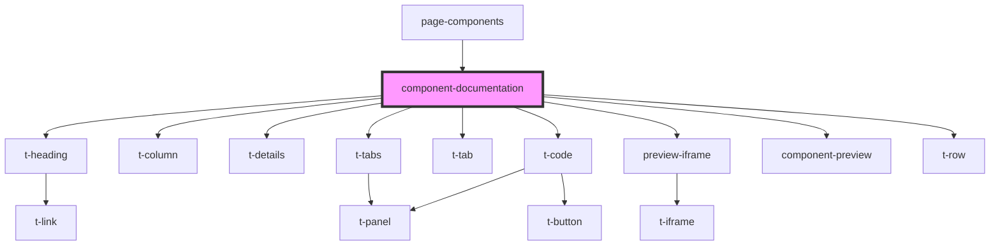

# component-documentation

<!-- Auto Generated Below -->

## Properties

| Property         | Attribute | Description | Type                                                                                                                            | Default     |
| ---------------- | --------- | ----------- | ------------------------------------------------------------------------------------------------------------------------------- | ----------- |
| `colourSettings` | --        |             | `{ hue: number; chroma: number; numberOfHues: number; contrast: number; hueOffsetVisitedLink: number; hueOffsetCode: number; }` | `undefined` |
| `examples`       | --        |             | `ComponentExample[]`                                                                                                            | `undefined` |
| `name`           | `name`    |             | `string`                                                                                                                        | `undefined` |

## Dependencies

### Used by

 - [page-components](../page-components)

### Depends on

- [t-heading](../../components/t-heading)
- [t-column](../../components/t-column)
- [t-details](../../components/t-details)
- [t-tabs](../../components/t-tabs)
- [t-tab](../../components/t-tab)
- [t-code](../../components/t-code)
- [preview-iframe](../preview-iframe)
- [component-preview](../component-preview)
- [t-row](../../components/t-row)

### Graph

----------------------------------------------

*Built with [StencilJS](https://stenciljs.com/)*
