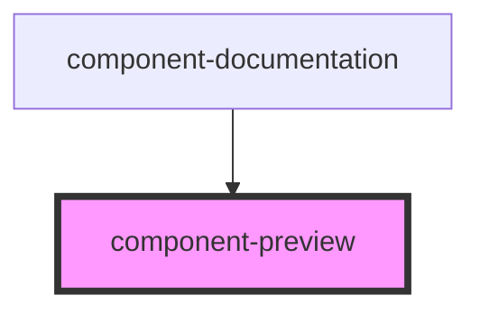

# component-preview

<!-- Auto Generated Below -->

## Properties

| Property            | Attribute | Description | Type                | Default     |
| ------------------- | --------- | ----------- | ------------------- | ----------- |
| `componentTestCode` | --        |             | `ComponentTestCode` | `undefined` |

## Dependencies

### Used by

 - [component-documentation](../component-documentation)

### Graph

----------------------------------------------

*Built with [StencilJS](https://stenciljs.com/)*
