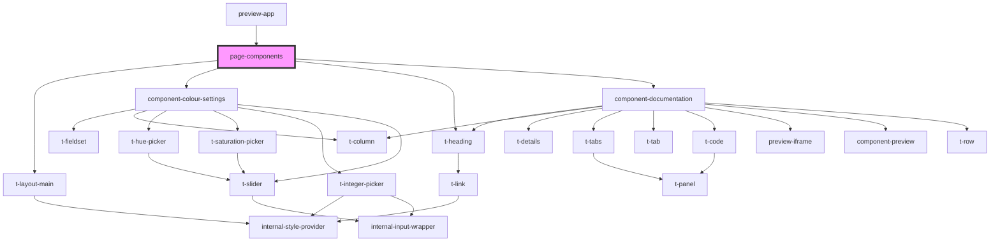

# page-components

<!-- Auto Generated Below -->

## Properties

| Property         | Attribute | Description | Type                                                                       | Default     |
| ---------------- | --------- | ----------- | -------------------------------------------------------------------------- | ----------- |
| `colourSettings` | --        |             | `{ hue: number; chroma: number; numberOfHues: number; contrast: number; }` | `undefined` |

## Events

| Event                  | Description | Type                                                                                    |
| ---------------------- | ----------- | --------------------------------------------------------------------------------------- |
| `colourSettingsChange` |             | `CustomEvent<{ hue: number; chroma: number; numberOfHues: number; contrast: number; }>` |

## Dependencies

### Used by

 - [preview-app](..)

### Depends on

- [t-layout-main](../../components/t-layout-main)
- [component-colour-settings](../component-colour-settings)
- [t-heading](../../components/t-heading)
- [component-documentation](../component-documentation)

### Graph

----------------------------------------------

*Built with [StencilJS](https://stenciljs.com/)*
