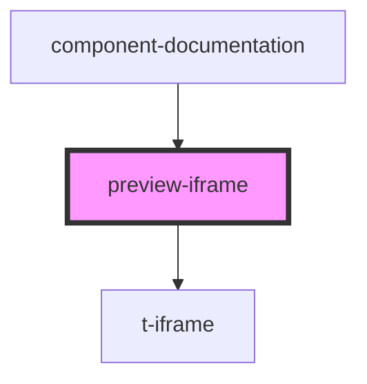

# preview-iframe

<!-- Auto Generated Below -->

## Properties

| Property            | Attribute | Description | Type                | Default          |
| ------------------- | --------- | ----------- | ------------------- | ---------------- |
| `chroma`            | `chroma`  |             | `number`            | `DEFAULT_CHROMA` |
| `componentTestCode` | --        |             | `ComponentTestCode` | `undefined`      |
| `hue`               | `hue`     |             | `number`            | `DEFAULT_HUE`    |

## Dependencies

### Used by

 - [component-documentation](../component-documentation)

### Depends on

- [t-iframe](../../components/t-iframe)

### Graph

----------------------------------------------

*Built with [StencilJS](https://stenciljs.com/)*
