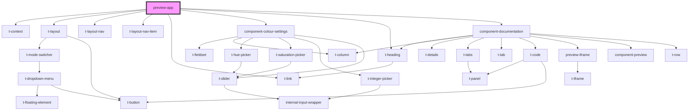

# preview-app

<!-- Auto Generated Below -->

## Dependencies

### Depends on

- [t-context](../components/t-context)
- [t-layout](../components/t-layout)
- [t-layout-nav](../components/t-layout-nav)
- [t-layout-nav-item](../components/t-layout-nav-item)
- [t-link](../components/t-link)
- [component-colour-settings](component-colour-settings)
- [t-heading](../components/t-heading)
- [component-documentation](component-documentation)

### Graph

----------------------------------------------

*Built with [StencilJS](https://stenciljs.com/)*
