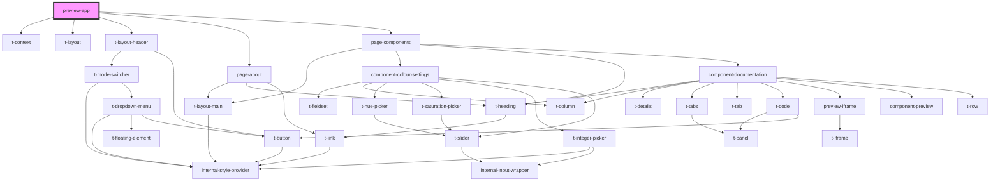

# preview-app

<!-- Auto Generated Below -->

## Dependencies

### Depends on

- [t-context](../components/t-context)
- [t-layout](../components/t-layout)
- [t-layout-header](../components/t-layout-header)
- [page-about](page-about)
- [page-components](page-components)

### Graph

----------------------------------------------

*Built with [StencilJS](https://stenciljs.com/)*
