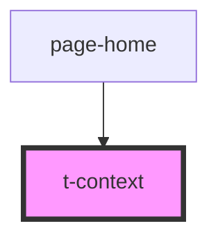

# t-context

<!-- Auto Generated Below -->

## Properties

| Property     | Attribute     | Description | Type      | Default |
| ------------ | ------------- | ----------- | --------- | ------- |
| `baseChroma` | `base-chroma` |             | `number`  | `0.3`   |
| `baseHue`    | `base-hue`    |             | `number`  | `160`   |
| `darkMode`   | `dark-mode`   |             | `boolean` | `false` |

## Dependencies

### Used by

 - [page-home](../../pages/page-home)

### Graph

----------------------------------------------

*Built with [StencilJS](https://stenciljs.com/)*
