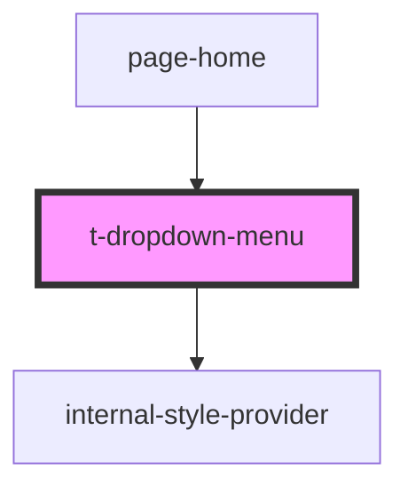

# t-dropdown-menu

<!-- Auto Generated Below -->

## Properties

| Property | Attribute | Description | Type     | Default     |
| -------- | --------- | ----------- | -------- | ----------- |
| `hue`    | `hue`     |             | `number` | `0`         |
| `label`  | --        |             | `VNode`  | `undefined` |
| `value`  | `value`   |             | `string` | `undefined` |

## Dependencies

### Used by

 - [page-home](../../pages/page-home)

### Depends on

- [internal-style-provider](../internal-style-provider)

### Graph

----------------------------------------------

*Built with [StencilJS](https://stenciljs.com/)*
