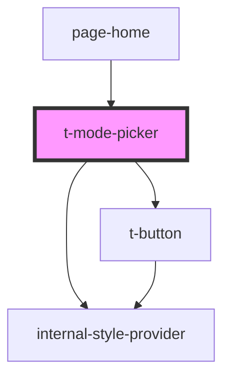

# t-mode-picker

<!-- Auto Generated Below -->

## Properties

| Property         | Attribute         | Description | Type                | Default   |
| ---------------- | ----------------- | ----------- | ------------------- | --------- |
| `hue`            | `hue`             |             | `number`            | `0`       |
| `mode`           | `mode`            |             | `"dark" \| "light"` | `'light'` |
| `systemSelected` | `system-selected` |             | `boolean`           | `true`    |

## Dependencies

### Used by

 - [page-home](../../pages/page-home)

### Depends on

- [internal-style-provider](../internal-style-provider)
- [t-button](../t-button)

### Graph

----------------------------------------------

*Built with [StencilJS](https://stenciljs.com/)*
